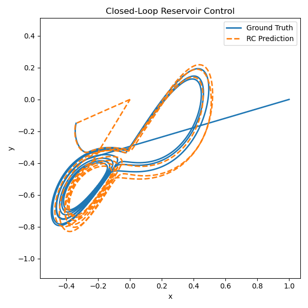

# Reservoir Computing for Tracking Control (Python Reproduction)

This repository is a **Python reimplementation** of the original [Tracking-Control project by Zheng-Meng](https://github.com/Zheng-Meng/Tracking-Control), which proposed a **model-free control framework using Reservoir Computing (RC)** to track complex trajectories with a two-link robotic arm.

> ⚙️ This codebase serves as a clean and extensible foundation for further experiments in RC-based control, and it also supports ongoing work in hyperparameter tuning (see related thesis repository).

---

## 🚀 Features

- 🧠 **Reservoir Computing controller** with trainable output layer (ridge regression)
- 🤖 **Two-link robot model** with full dynamics and kinematics
- 🔁 **Closed-loop control** that uses the RC model to generate torque commands
- 📈 **Trajectory tracking** for paths like circles, figure-eights, and Lorenz attractors
- 📂 **MATLAB-compatible data loading** for trajectories and training sets
- 📊 **Evaluation tools** (e.g. RMSE) for comparing predicted vs. desired trajectories

---

## 🗂️ Structure

| File              | Description |
|-------------------|-------------|
| `rc.py`           | Reservoir Computing model (training, prediction, internal state) |
| `robot.py`        | Two-link robot dynamics, kinematics, and trajectory generation |
| `control.py`      | Core closed-loop control loop |
| `utils.py`        | Helper functions: RMSE, trajectory loader |
| `control_test.py` | Example test script (loads `.mat` data, runs control loop, plots results) |

---

## 🔧 Requirements

- Python 3.8+
- NumPy, SciPy, Matplotlib
- `.mat` files from the original MATLAB project (for training and evaluation)

---

## 📊 Example Plot

Below is an example of a tracked trajectory (e.g. Lorenz) compared to the ground truth:

---

## 📌 Notes

- The control logic and robot simulation match the behavior of the original MATLAB code as closely as possible.
- For hyperparameter tuning and large-scale evaluation, see the separate [thesis repository (link coming soon)].
